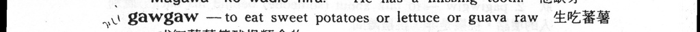

ocr-guess
=========

對圖片同時做中英文OCR，並猜測哪行結果較為正確

主要用來辨識只含有單行文字的圖片。例如：

由於內容可能包含中文及英文，同時作兩種語言的ocr，可以方便我們由兩種結果中取較正確的部份出來修改，以得到正確的結果，減少人工打字的麻煩。

相依軟體
========

*   tesseract, 需安裝中文語言檔(chi_tra)

使用範例
========

此script可以單獨執行，也能做函式庫使用

函式庫：
    import ocr_guess
    
    print ocr_guess.get_ocr_guess('sample.jpg',True)

單獨執行：
    ./ocr_guess.py -p -t -v *.jpg > result.json

可得到類似這樣的結果：
    [
        {
            "cht": "啷二】 gaWg蠶W 一【o ea【 SWee! p0【a【oeS or le【tuCe 。【 guaVa r矗W 生吃蕃薯",
            "eng": "NW.‘ gawgaw —to eat sweet potatoes or lettuce or guava raw §“Z§§",
            "img": "105_018.jpg"
        },
    ]

英文結果含有「 gawgaw —to eat sweet potatoes or lettuce or guava raw」，中文則有「生吃蕃薯」

校對人員便能直接複製這些文字，不需自己打

ocr正確率仍受限於tesseract本身的辨識能力

